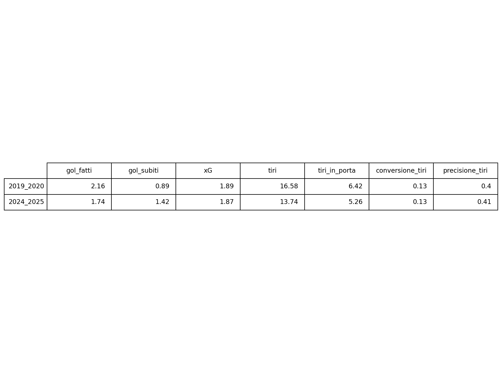
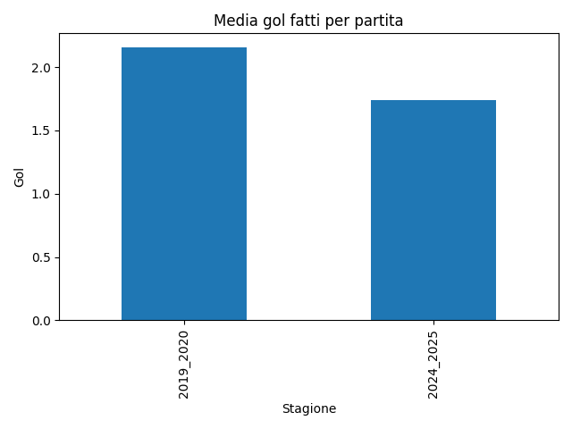
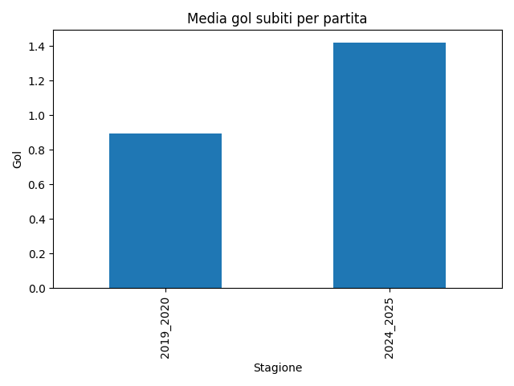
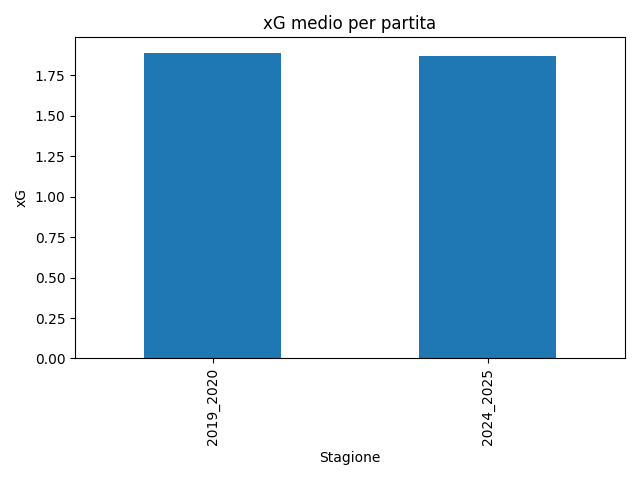
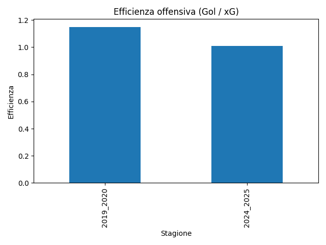
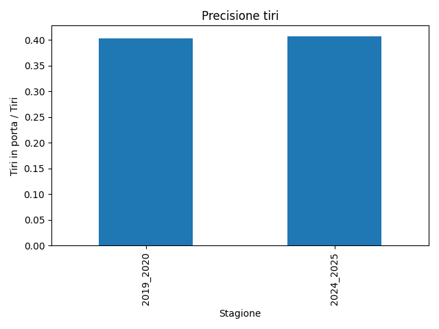
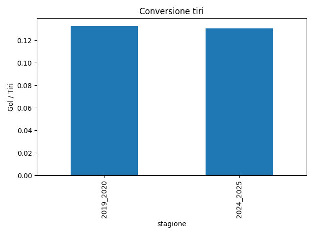
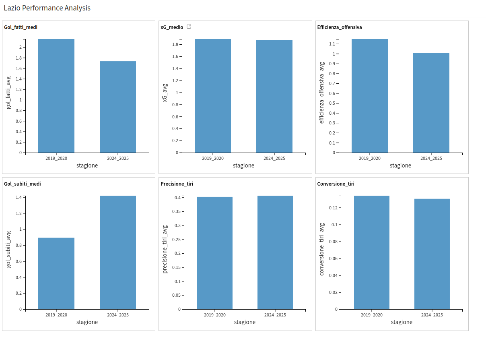
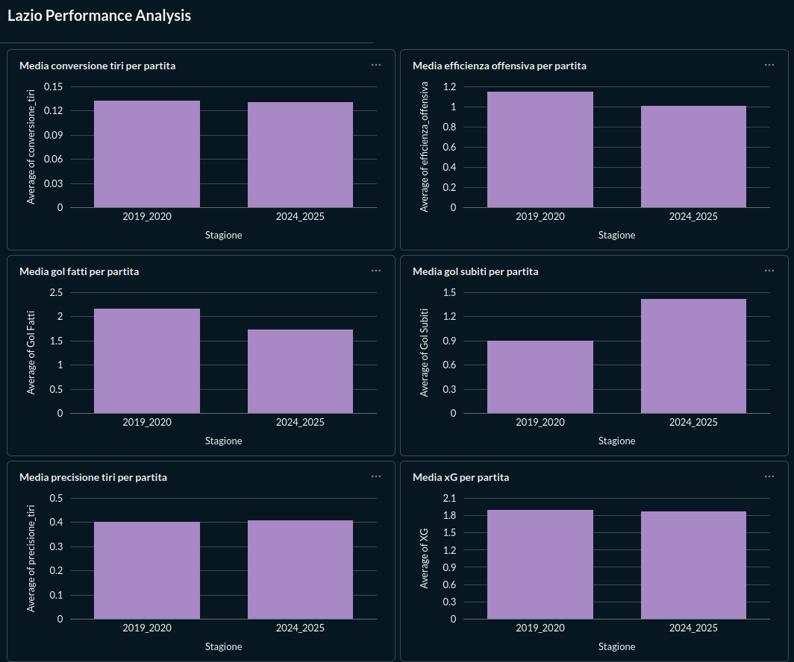

# Lazio Performance Analysis ⚽📊

Confronto delle prestazioni della **Lazio tra le stagioni di Serie A 2019/2020 e 2024/2025** utilizzando metriche di football analytics.

---

# Obiettivo del progetto

Questo progetto analizza e confronta le prestazioni della **Lazio in due stagioni di Serie A**:

- **2019/2020**
- **2024/2025**

L'analisi considera **le prime 19 giornate di campionato (girone di andata)** per entrambe le stagioni.

L’obiettivo è valutare le differenze di performance attraverso **statistiche calcistiche e metriche avanzate utilizzate nella football analytics**.

---

# Dataset

I dati sono stati raccolti manualmente partita per partita e organizzati in file **CSV**.

Per ogni partita sono state registrate le seguenti informazioni.

## Informazioni partita

- giornata  
- avversario  
- casa / trasferta  

## Performance della squadra

- gol fatti  
- gol subiti  
- tiri  
- tiri in porta  
- possesso palla  
- expected goals (**xG**)

## Distribuzione dei gol

- gol fatti 1° tempo  
- gol fatti 2° tempo  
- gol subiti 1° tempo  
- gol subiti 2° tempo  
- gol nei minuti di recupero  

Dataset finale generato:

data/lazio_dataset_completo.csv

---

# Metriche analizzate

Oltre alle statistiche base sono state calcolate alcune **metriche avanzate utilizzate nell’analisi calcistica**.

## Efficienza offensiva

Misura quanto una squadra segna rispetto alla qualità delle occasioni create.

Formula:

efficienza_offensiva = gol_fatti / xG

---

## Precisione tiri

Indica la percentuale di tiri che finiscono nello specchio della porta.

Formula:

precisione_tiri = tiri_in_porta / tiri

---

## Conversione tiri

Indica quanti tiri vengono trasformati in gol.

Formula:

conversione_tiri = gol_fatti / tiri

---

# Pipeline dati

Il progetto include una **pipeline di trasformazione dati sviluppata in Python**.

Fasi della pipeline:

1. Caricamento dataset stagioni  
2. Pulizia e verifica dei dati  
3. Calcolo delle metriche avanzate  
4. Unione dei dataset  
5. Creazione del dataset finale  

Script principale:

pipeline/data_pipeline.py

---

# Struttura del progetto

lazio-analysis
│   ├── data
│   │   ├── lazio_2019_2020_andata.csv
│   │   ├── lazio_2024_2025_andata.csv
│   │   └── lazio_dataset_completo.csv
│   ├── images
│   │   ├── conversione_tiri.png
│   │   ├── dataiku_dashboard.png
│   │   ├── dataiku_grafici.png
│   │   ├── efficienza_offensiva_media.png
│   │   ├── media_gol_fatti.png
│   │   ├── media_gol_subiti.png
│   │   ├── metabase_dashboard.png
│   │   ├── precisione_tiri.png
│   │   ├── tabella_confronto.png
│   │   └── xg_medio.png
│   ├── notebooks
│   │   ├── grafici_dataset_unito.ipynb
│   │   └── grafici.ipynb
│   ├── pipeline
│   │   ├── crea_dataset.py
│   │   └── data_pipeline.py
│   ├── README.md
│   └── requirements.txt

---

# Visualizzazioni

---

# Pipeline Dataiku

Parte del progetto è stata replicata anche utilizzando **Dataiku**, per dimostrare una **pipeline di trasformazione dati visuale**.

Struttura della pipeline:

Dataset → Prepare → Group → Dashboard

La pipeline Dataiku esegue:

- preparazione dei dati
- calcolo delle metriche di football analytics
- aggregazione per stagione
- creazione di grafici di confronto

---

# Dashboard Metabase

Il dataset finale è stato collegato anche a **Metabase** per creare una dashboard di Business Intelligence.

In Metabase sono state create visualizzazioni che confrontano le due stagioni attraverso:

- media gol fatti
- media gol subiti
- xG medio
- efficienza offensiva
- precisione tiri
- conversione tiri

Le metriche sono state calcolate tramite **colonne calcolate direttamente nella piattaforma** e aggregate per stagione.

Questo permette di visualizzare rapidamente le differenze di performance tra le due stagioni.

---

# Tecnologie utilizzate

- Python  
- Pandas  
- Matplotlib  
- Jupyter Notebook  
- Dataiku  
- Metabase  

---

# Conclusione

Questo progetto mostra un flusso completo di **data analysis applicato al calcio**.

Il lavoro include:

- raccolta e preparazione dei dati
- sviluppo di una pipeline dati in Python
- creazione di metriche di football analytics
- visualizzazione dei dati tramite grafici
- costruzione di pipeline visuali con Dataiku
- creazione di dashboard interattive con Metabase

L'obiettivo è dimostrare come strumenti diversi possano essere integrati in un unico progetto di **analisi dati sportiva**, passando dalla preparazione dei dati fino alla visualizzazione finale delle informazioni.